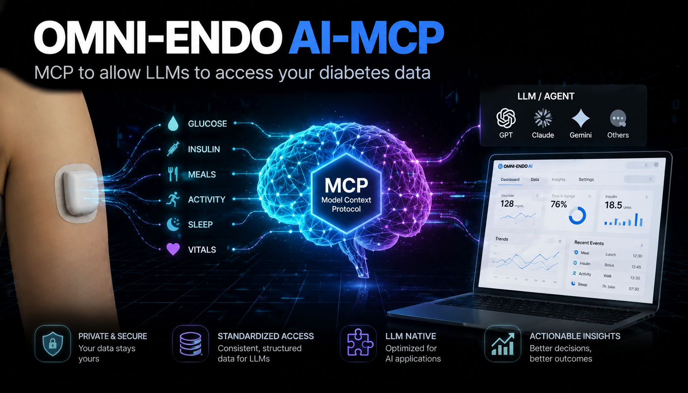

<div align="center">
  <kbd></kbd>
</div>

# OMNI-ENDO AI (MCP)
**Clinical Audit & Triage Tool: connect your diabetes data directly to an AI assistant**

---

## 📖 Table of Contents
* [What is Omni-Endo AI?](#what-is-omni-endo-ai)
  * [What does it actually do?](#what-does-it-actually-do)
  * [The "Aha!" Moment](#the-aha-moment)
  * [Why I Built This](#why-i-built-this)
* [Who This Is For](#who-this-is-for)
* [Privacy & Security](#privacy--security)
* [The "Tough Love" AI Persona](#the-tough-love-ai-persona)
* [Step 1: Getting Ready (Installing Docker)](#step-1-installing-docker)
* [Step 2: Getting the Files](#step-2-getting-the-files)
* [Step 3: Configure Your Settings (`.env`)](#step-3-configure-your-settings)
* [Try it with the Example Data](#try-it-with-the-example-data)
* [Step 4: Build the Tool](#step-4-build-the-tool)
* [Section A: Use it with Claude Desktop](#section-a-claude-desktop)
* [Section B: Use it with Open WebUI](#section-b-open-webui)
* [How to Stop](#how-to-stop)
* [Troubleshooting](#troubleshooting)
* [Get in Touch](#get-in-touch)
* [API Reference](#api-reference)
* [How the Code is Organised](#how-the-code-is-organised)
* [Disclaimer](#disclaimer)

---

<a id="what-is-omni-endo-ai"></a>
## 🌟 What is Omni-Endo AI?
**Omni-Endo AI** is a bridge between your diabetes data and an AI assistant. It is an **MCP server** (Model Context Protocol), which is a standard way of giving an AI a set of tools it can use on your behalf.

Instead of copying and pasting reports, you simply *talk* to your assistant. You ask a question in plain language, and the assistant reaches into your data, pulls exactly what it needs, and analyses it for you, all within the conversation.

You ask things like:
* *"How was my time in range last month?"*
* *"Why do I keep going high in the evenings?"*
* *"Show me my worst day and tell me what happened."*

<a id="what-does-it-actually-do"></a>
### 🚀 What does it actually do?
Omni-Endo AI exposes your diabetes history as a set of analytical tools the AI can call:

* **Summaries and trends:** time in range, GMI, variability, best and worst days and hours, basal/bolus balance, over any period you ask about.
* **High-fidelity CGM data:** every 5-minute reading is captured, so no spike or dip is missed, but the AI is guided to pull *aggregates first* and only fetch raw readings when it genuinely needs them.
* **Enriched bolus analysis:** each bolus is matched with the glucose at the time and the pump settings (ISF, carb ratio, target) that were active, so the AI can judge whether a dose made sense.
* **Omnipod 5 behaviour:** when the algorithm was suspending, running at max, or running blind after losing signal.

The assistant does all of this itself, live, by calling these tools while it talks to you.

<a id="the-aha-moment"></a>
### The "Aha!" Moment
This project started with a personal frustration. While trying to integrate my diabetes data into a **Home Assistant** dashboard, I discovered that the wealth of historical data stored in **Glooko** (especially from the **Omnipod 5**) is a goldmine. I realised that if I gave that data to an AI assistant and let it query the data directly, it could uncover patterns that months of manual logging never showed.

<a id="why-i-built-this"></a>
### Why I Built This
I built this to put the power back into the hands of the patient. We often only get 15 minutes with a consultant every few months. This tool lets you:
1. **Be Proactive:** spot trends before your next appointment.
2. **Be Private:** your data and credentials stay on your own machine.
3. **Be Flexible:** use it with Claude Desktop, or with a local or cloud AI through Open WebUI.

---

<a id="who-this-is-for"></a>
## 👤 Who This Is For

This project is built for people who use the **Omnipod 5** closed-loop insulin delivery system and sync their data to **Glooko**. If that is not you, you can still explore the project using the three months of included sample data — no Omnipod 5 or Glooko account required for that path.

### Prerequisites

**Required by everyone**
- **Docker** — the entire stack runs inside Docker. Install it from [docker.com](https://www.docker.com/get-started). See [Step 1](#step-1-installing-docker) below.

**Required if you want to analyse your own data**
- **An Omnipod 5** — the insulin delivery device whose data this project analyses.
- **A Glooko account** — with your Omnipod 5 synced to it. This is how the MCP server retrieves your data.

**Required — you need at least one AI to talk to**

| Option | What you need | Data leaves your machine? |
|--------|--------------|--------------------------|
| **Claude Desktop** | Free download from [claude.ai/download](https://claude.ai/download) | Yes, to Anthropic |
| **Google Gemini** (via Open WebUI) | Free API key from [Google AI Studio](https://aistudio.google.com/) | Yes, to Google |
| **Ollama** (via Open WebUI) | [Ollama](https://ollama.com) installed locally | No |

> **ChatGPT / OpenAI:** MCP support may be possible in principle, but this project has not been tested with it. The free tier does not support MCP configuration and it is not a supported path here. But try it out and let me know!

---

<a id="privacy--security"></a>
## 🔒 Privacy & Security: Your Data, Your Control
Because this involves sensitive medical credentials and data, it is designed with a **"local-first" architecture**.

* **No Middle Man:** your Glooko username and password never leave your machine. They are sent directly from your local Docker container to Glooko's servers. No third-party server ever sees them.
* **It runs on your computer:** the server, the database, and the analysis tools all run locally in Docker.
* **You choose the AI:** connect it to Claude Desktop, to Google Gemini via Open WebUI, or to a local model through Open WebUI. With a local model, your data never leaves your machine at all.

> [!IMPORTANT]
> If you use a cloud AI assistant (Claude, Gemini), most providers have a setting that allows them to "train" on your conversations. Before discussing your clinical data, consider turning off chat history / model training in that assistant's privacy settings, so your medical history stays private.

> [!TIP]
> Want to try it before connecting your own account? This repository ships with a small **example database** of real data so you can explore everything offline, with no Glooko login at all. See **"Try it with the example data"** below.

---

<a id="the-tough-love-ai-persona"></a>
## 🧐 The "Tough Love" AI Persona
The tool ships with a built-in AI persona: a **"Tough Love" Endocrinologist**.

Managing Type 1 Diabetes is hard, and placating a user doesn't improve Time in Range. The persona is direct, analytical, and uncompromising. It won't sugar-coat the data; it will tell you where your bolus timing is off, where you are over-correcting, or where your basal is failing to catch a drift. It is also built to work *efficiently*, pulling summaries first and only drilling into granular data when it needs to.

When you connect the tool, this persona is available as a selectable prompt called **"Clinical auditor persona"**. Selecting it is what turns the AI into the endocrinologist.

---

> [!WARNING]
> Be aware that links in this document may take you away from this page. To open in a new tab, right-click and select **Open Link in New Tab**.

<a id="step-1-installing-docker"></a>
## 🛠️ Step 1: Getting Ready (Installing Docker)
To run this tool we use **Docker**. Think of Docker as a "shipping container" for software: it lets Omni-Endo AI run perfectly on your computer without you installing complicated code libraries by hand.

This may require a restart, so make sure you are ready for that before starting.

### **For Windows Users**
1. **Download:** Go to the [Docker installation instructions for Windows](https://docs.docker.com/desktop/setup/install/windows-install/), read the options, and download the one that suits your machine. For most users this is **Docker Desktop for Windows - x86_64**.
2. **Install:** Run the `.exe`. **Important:** during installation, ensure **"Use WSL 2 instead of Hyper-V"** is checked.
3. **Restart:** Your computer will likely ask to restart.
4. **Start:** Open "Docker Desktop" from the Start Menu and accept the terms.

> [!WARNING]
> If you see a WSL version issue, see [this guide](https://docs.docker.com/desktop/setup/install/windows-install/#option-1-install-or-update-wsl-via-the-terminal) to resolve it.

### **For Mac Users**
1. **Download:** Go to the [Docker installation instructions for Mac](https://docs.docker.com/desktop/setup/install/mac-install/).
   - Choose **"Apple Chip"** for a newer Mac (M1, M2, M3, M4).
   - Choose **"Intel Chip"** for an older Mac.
2. **Install:** Open the `.dmg` and drag Docker into your **Applications** folder.
3. **Start:** Open Docker from Applications. You may need to enter your Mac password to grant permission.

> [!NOTE]
> Make sure Docker Desktop is actually *running* (you'll see its whale icon in your menu bar or system tray) before continuing.

---

<a id="step-2-getting-the-files"></a>
## 📂 Step 2: Getting the Files
1. **Download the Code:** On [this GitHub page](https://github.com/rilhia/omni-endo-ai-mcp), click the green **"<> Code"** button, then **"Download ZIP"**.
2. **Extract:** Open your Downloads folder, right-click the zip, and choose **"Extract All"**.
3. **Move:** Move the extracted folder somewhere easy to find and remember, this location matters for the steps below. For example:
   `/Users/richard/Development/Docker/agents/omni-endo-mcp`

Inside, you should see:
* `src/` (the application code)
* `examples/` (the example database)
* `docker-compose.yml`
* `Dockerfile`
* `.env.example`
* ...and a few other small files.

---

<a id="step-3-configure-your-settings"></a>
## ⚙️ Step 3: Configure Your Settings (`.env`)
The tool reads its settings from a file called `.env`. The repository includes a template called `.env.example`, you make your own copy and fill it in.

1. **Copy the template:** Make a copy of `.env.example` and rename the copy to exactly `.env` (just `.env`, nothing before the dot).
2. **Open `.env`** in any text editor and edit it for one of the two scenarios below.

### Scenario 1: Just trying it with the example data (no Glooko login)
This is the easiest way to start, and it never contacts Glooko.

* `GLOOKO_EMAIL` and `GLOOKO_PASSWORD`: **leave both blank.** Blank credentials put the tool in offline mode, so it only ever reads the example database.
* `GLOOKO_GLUCOSE_UNIT`: set to `mmol`. The example data is mine, and I am British, so it is recorded in mmol/L.
* `OMNI_TOKEN`: set any hard-to-guess phrase (only needed for the Open WebUI path).
* The display settings (`OMNI_UNITS`, `OMNI_LOWER`, `OMNI_UPPER`) can be left at their mmol defaults to view it the way I do.

The example `.env` below is ready to use for a test against the provided data. Copy it as-is (just change `OMNI_TOKEN`):

```bash
# ============================================================================
#  Omni-Endo AI: configuration
# ============================================================================
#  Copy this file to ".env" (same folder) and fill in the two REQUIRED values
#  below. Everything else has sensible defaults you can leave alone.
#
#  Docker reads this file literally: do NOT put quotes around values, and a
#  line starting with "#" is a comment.
# ============================================================================

# --- Glooko login (OPTIONAL) ------------------------------------------------
#  Your Glooko email and password let the server download YOUR data and keep it
#  up to date. They stay on your machine and are never shared.
#
#  LEAVE THESE BLANK to run in OFFLINE mode: the server will NEVER contact
#  Glooko and will serve only the data already in its database (for example, a
#  sample database shipped with the project). This is the safe way to explore
#  with example data, or to run against a database you have already built.
#
#  Fill them in to download and refresh your own data.
GLOOKO_EMAIL=
GLOOKO_PASSWORD=

# --- IMPORTANT if you provide a Glooko login: your Glooko account's unit ------
#  Glooko sends your data in whatever glucose unit your Glooko ACCOUNT is set to
#  (often mg/dL for US accounts, mmol/L elsewhere). Set this to match your Glooko
#  account so the data is interpreted correctly as it is downloaded. Getting this
#  wrong corrupts the stored data (e.g. a 162 mg/dL reading stored as 162 mmol/L).
#
#  This is SEPARATE from OMNI_UNITS below: this one is how your data ARRIVES from
#  Glooko; OMNI_UNITS is how you want to SEE it. They can differ (e.g. a US user
#  whose Glooko is mg/dL could still choose to view everything in mmol/L).
#
#  Values: "mmol" (mmol/L, default) or "mgdl" (mg/dL). Only matters when you have
#  a Glooko login; ignored in offline mode.
GLOOKO_GLUCOSE_UNIT=mmol

# --- REQUIRED: a secret token ----------------------------------------------
#  Any hard-to-guess phrase. It protects the data endpoint so only you (and the
#  tools on your own machine) can reach it. Change it from the default below.
#  To generate a strong one, run:  openssl rand -hex 16
OMNI_TOKEN=change-me-to-a-secret

# --- OPTIONAL: your preferred glucose unit and target range ----------------
#  Set these once to your preference and every tool uses them by default, so you
#  never have to specify them per question. You (or the AI) can still override
#  them for a one-off query without changing this file.
#
#  OMNI_UNITS:  "mmol" (mmol/L, default) or "mgdl" (mg/dL).
#  OMNI_LOWER:  low/hypo boundary, IN THE UNIT ABOVE. Readings below = time-low.
#  OMNI_UPPER:  high/hyper boundary, IN THE UNIT ABOVE. Readings above = time-high.
#
#  IMPORTANT: the boundaries must be in the same unit as OMNI_UNITS. For mmol the
#  usual range is 3.9 to 10.0; for mgdl it is 70 to 180. If you leave these blank
#  the defaults are 3.9/10.0 for mmol or 70/180 for mgdl.
OMNI_UNITS=mmol
OMNI_LOWER=3.9
OMNI_UPPER=10.0

# --- OPTIONAL: how far back to load on first run ---------------------------
#  Only used when you HAVE provided a Glooko login above. On first use the
#  server downloads your history from this date to now. If you leave it blank,
#  it defaults to 3 MONTHS before today, which is fast and is the amount in the
#  example database. Set an earlier date to capture more history.
#  Format: YYYY-MM-DD.
OMNI_OLDEST_DATE=

# ============================================================================
#  Advanced (most people never change these)
# ============================================================================
#  Ports exposed on your machine. Change only if something else already uses
#  them. Format is HOST:CONTAINER inside docker-compose.yml.
#    Data server (MCP/SSE/API):  3033
#    API explorer + Ollama API:  8000
#    Open WebUI (chat with Ollama): 8083
```

### Scenario 2: Using your own Glooko data
To connect your own account and download your own history:

1. **Create a `data` folder** at the same level as the `src` folder, and make sure it is **empty** (this is where your downloaded data will be stored). If you previously copied the example database in to try Scenario 1, remove it first so your data is not mixed with mine.
2. **Add your Glooko login:** set `GLOOKO_EMAIL` and `GLOOKO_PASSWORD` to your normal Glooko credentials.
3. **Set the remaining values to match you:**
   * `GLOOKO_GLUCOSE_UNIT` — the unit your **Glooko account** is set to (`mmol` or `mgdl`). Get this right, it is how your data is read as it downloads.
   * `OMNI_TOKEN` — your secret token (any hard-to-guess phrase).
   * `OMNI_UNITS` — how you want to **see** your data (`mmol` or `mgdl`).
   * `OMNI_LOWER` / `OMNI_UPPER` — your target range, in the unit you chose for `OMNI_UNITS`.
   * `OMNI_OLDEST_DATE` (optional) — how far back to load on the first run; blank means the last 3 months.

> [!IMPORTANT]
> `GLOOKO_GLUCOSE_UNIT` (how your data **arrives** from Glooko) and `OMNI_UNITS` (how you want to **see** it) are different settings. They can be the same, but they do not have to be.

---

<a id="try-it-with-the-example-data"></a>
## 🧪 Try it with the example data (optional, no login needed)
This repo ships with a real example database so you can try everything before connecting your own account.

1. In the project folder, **create a folder called `data`** if it isn't already there.
2. **Copy** the file `examples/omni-endo.db` **into** that `data` folder.
3. Make sure your `.env` has the **Glooko fields left blank** (this puts the tool in offline mode, so it will only ever read the example database and will never try to download anything).

That's it — when you run the tool and connect your AI, it will analyse the example data exactly as if it were your own.

> [!NOTE]
> The example data is my own real diabetes data, shared on purpose so people have something genuine to explore. When you later switch to your own account, your data lives in the same `data` folder and stays on your machine.

---

<a id="step-4-build-the-tool"></a>
## ▶️ Step 4: Build the Tool
Now we build the Docker image that both Claude and Open WebUI will use.

1. **Open a Terminal:**
   - **Windows:** open "PowerShell" from the Start Menu.
   - **Mac:** open "Terminal" (Cmd + Space, type Terminal).
2. **Go to the folder:** type `cd` then a space, then drag your project folder into the terminal window so the path fills in, and press Enter. For example:
   `cd /Users/richard/Development/Docker/agents/omni-endo-mcp`
3. **Build it:** run this command and press Enter:
   ```bash
   docker compose build --no-cache
   ```
   The first time, Docker downloads what it needs and builds the image; this can take a few minutes.

> [!IMPORTANT]
> If you ever download a newer version of this tool, always rebuild with `docker compose build --no-cache`. A plain start can reuse an old cached image and run outdated code.

You now have everything built. There are two ways to use it: **Claude Desktop** (Section A) or **Open WebUI** (Section B). You can set up either or both.

---

<a id="section-a-claude-desktop"></a>
## 🅰️ Section A: Use it with Claude Desktop

With Claude Desktop, Claude launches its own copy of the tool on demand and reads your data directly. You do **not** need to keep anything running in the terminal for this — Claude starts and stops the container itself.

### A1. Find your Claude config file
Claude Desktop is configured by a file called `claude_desktop_config.json`.

* **Mac:** `/Users/<yourname>/Library/Application Support/Claude/claude_desktop_config.json`
* **Windows:** `%APPDATA%\Claude\claude_desktop_config.json`

The easiest way to open it: in Claude Desktop go to **Settings → Developer → Edit Config**. That opens the right file for you.

### A2. Add the omni-endo server
Add an `mcpServers` entry to the file. The block below is an **example using my own folder paths** — it will not work as-is on your machine, because the two paths point at where the project lives on *my* computer. Use it as a template and change those two paths to match *your* setup.

```json
{
  "mcpServers": {
    "omni-endo": {
      "command": "docker",
      "args": [
        "run",
        "-i",
        "--rm",
        "--env-file",
        "/Users/richard/Development/Docker/agents/omni-endo-mcp/.env",
        "-v",
        "/Users/richard/Development/Docker/agents/omni-endo-mcp/data:/data",
        "omni-endo-ai-mcp"
      ]
    }
  }
}
```

If the file already has an `mcpServers` section, add just the `"omni-endo"` block inside it rather than pasting the whole thing.

**How this relates to your setup — change these two paths:**

Both paths above start with my project folder, `/Users/richard/Development/Docker/agents/omni-endo-mcp`. Yours will be wherever you moved the extracted folder in Step 2. Replace my path with yours in both places:

* **The `--env-file` line** must point to your `.env` file: `<your project folder>/.env`
* **The `-v` line** must point to your `data` folder: `<your project folder>/data:/data`

The part **after** the colon (`:/data`) is the path *inside* the container and must be left exactly as it is — only change the part before the colon.

The last line, `omni-endo-ai-mcp`, is the name of the Docker image you built in Step 4, and stays the same for everyone.

> [!TIP]
> Easiest way to get your exact path: in a terminal, `cd` into your project folder and run `pwd` (Mac) or `cd` with no arguments (Windows shows the path). Copy what it prints and use it in both lines above.

> [!NOTE]
> Always use the full path. On Mac it starts with `/Users/yourname/...`; on Windows it looks like `C:\\Users\\YourName\\...` (note the double backslashes, which JSON requires).

### A3. Restart Claude Desktop
Fully quit Claude Desktop (on Mac, Cmd + Q, not just closing the window) and open it again, so it picks up the new config.

### A4. Make sure the tools are loaded
In a chat, open the connector / tools menu. You should see **omni-endo** with its tools.

> [!IMPORTANT]
> Claude Desktop has a setting for how it loads tools. If it is set to **"Load tools when needed"**, it may not show the summary and trend tools straight away. For the best experience, set it to **"Tools already loaded"** so every tool is available immediately. This is the single most common setup snag.

<kbd></kbd>

*(Image: the Claude Desktop connector menu showing "Tool access" set to "Tools already loaded".)*

### A5. Select the persona and ask away
From the same menu, choose the **"Clinical auditor persona"** prompt, then ask your question. A good first one:

> *"Check what date ranges you have in my diabetes data, then give me an overview of how I'm doing."*

<kbd></kbd>

*(Image: Claude using the tools to answer a question about your data.)*

---

<a id="section-b-open-webui"></a>
## 🅱️ Section B: Use it with Open WebUI

This path lets you use either a **local AI model** running on your own machine via [Ollama](https://ollama.com), or a **cloud model via Google Gemini**, through a browser-based chat interface. It uses the full Docker stack, which also includes a bridge that turns the tools into a normal web API.

### B1. Start the stack
In your terminal, in the project folder, run:
```bash
docker compose up -d
```
This starts three things: the data server, a bridge (so web tools can reach it), and Open WebUI. The first question you ask may take a little longer while it loads your data.

To check it is running:
```bash
docker compose logs omni-endo
```

### B2. Create your Open WebUI account
Open **http://localhost:8083** in your browser. On first launch, Open WebUI will ask you to create an account.

1. Click **Sign up** and enter a name, email address, and password. This account is local — it does not connect to any external service.
2. The first account you create automatically becomes the admin account.

### B3. Connect an AI model

You need to connect Open WebUI to an AI backend. Choose one of the options below.

#### Option A: Google Gemini (cloud, free tier available)

**Get a Gemini API key**

1. Go to [Google AI Studio](https://aistudio.google.com/) and sign in with your Google account.
2. Click **Get API Key**, then **Create API key**.
3. Copy the key and keep it somewhere safe.

**Configure the connection in Open WebUI**

1. Click your profile icon in the bottom-left corner and go to **Admin Panel → Settings → Connections**.
2. Under the **OpenAI API** section, click **+** to add a new connection and enter:
   - **API Base URL:** `https://generativelanguage.googleapis.com/v1beta/openai`
   - **API Key:** paste your Gemini API key
3. Click **Save**. Open WebUI will verify the connection and pull in the available models.

**Select a Gemini model**

1. Go back to the main chat window and click the model dropdown at the top.
2. Search for `gemini` — do not search for "google". Models are listed by engine name, for example `gemini-2.5-flash` or `gemini-1.5-pro`.
3. Select your preferred model and start chatting.

> [!IMPORTANT]
> If you use Gemini, your glucose and insulin data is sent to Google's servers as part of the conversation. Consider disabling chat history / model training in your Google AI Studio privacy settings before discussing your clinical data.

#### Option B: Ollama (local models, nothing leaves your machine)

Install [Ollama](https://ollama.com), then pull a model that supports tools. For example:
```bash
ollama pull qwen2.5
```

Then go to **Admin Panel → Settings → Connections** and add your Ollama endpoint (typically `http://host.docker.internal:11434`). Your locally available models will appear in the model dropdown.

> [!NOTE]
> Local models vary a lot in how well they use tools. `qwen2.5` is a reliable starting point; very small models often struggle to call tools correctly.

---

### B4. Enable the MCP server in Open WebUI

This connects Open WebUI to the omni-endo MCP server so the AI can call the data tools.

1. Go to **Admin Panel → Settings → Connections**.
2. Scroll to the **MCP** section and click **+** to add a new connection.
3. Set the **Type** to **MCP Streamable HTTP** and enter the following:

   | Field | Value |
   |-------|-------|
   | Name | `omni-endo-ai-mcp` |
   | URL | `http://omni-endo:3033/mcp` |
   | Auth | Bearer |
   | Token | the `OMNI_TOKEN` value from your `.env` file |

4. Click **Save**.

When you first open the Add Connection screen, you will see the default placeholder token `change-me-to-a-secret` already filled in the token field:

<kbd></kbd>

*(Image: the Add Connection screen in Open WebUI showing the default placeholder token.)*

Replace it with the `OMNI_TOKEN` value you set in your `.env` file, then save. Once saved, the token will be shown masked:

<kbd></kbd>

*(Image: the saved omni-endo MCP connection with the token masked.)*

The refresh icon next to the URL can be used to test connectivity at any time.

> [!NOTE]
> Open WebUI's MCP support is experimental and the specification changes periodically. If you encounter connection errors after an Open WebUI update, check the project's issues page for compatibility notes.

---

### B5. Chat
Start a new chat, select your model, make sure the omni-endo tools are enabled for the chat, and ask away. A good first question:

> *"Check what date ranges you have in my diabetes data, then give me an overview of how I'm doing."*

### B6. Explore the raw API (optional)
The bridge also gives you a browsable API. Open **http://localhost:8000/docs** to see every tool, read what it does, and try it out (you'll be asked for your `OMNI_TOKEN`).

> [!NOTE]
> All dates in the API are **UTC**. If you call it directly, send UTC times and expect UTC back.

---

<a id="how-to-stop"></a>
## 🛑 How to Stop
* **Claude Desktop path:** nothing to stop — Claude shuts the container down itself when it's done.
* **Open WebUI path:** in your terminal, in the project folder, run:
  ```bash
  docker compose down
  ```

---

<a id="troubleshooting"></a>
## 🛠️ Troubleshooting
> [!NOTE]
> This section will grow over time. If you hit something not covered here, please open an issue and I'll help.

**Only some tools show up in Claude (e.g. just two).**
Set Claude's tool loading to **"Tools already loaded"** (Section A4). In "Load tools when needed" mode Claude may not surface the summary/trend tools for a given question.

**Claude seems to be running old behaviour after an update.**
Rebuild the image: `docker compose build --no-cache`. A cached image can keep running old code.

**"Port already in use".**
Another app is using a port (3033, 8000, or 8083). Open `docker-compose.yml` and change the first number in the relevant `"XXXX:YYYY"` mapping (e.g. `"8083:8080"` to `"8090:8080"`), then start again and use the new port.

**Open WebUI can't reach the MCP tools.**
Check the URL is `http://omni-endo:3033/mcp` (not `localhost`) and that the bearer token matches your `OMNI_TOKEN` exactly.

**I asked about a date and got nothing back.**
If you're using the **example data** (offline mode), only the example's date range is available. Ask the assistant what date range it holds first.

**Gemini models don't appear in the model dropdown.**
Search for `gemini`, not `google`. The models are prefixed by engine name. If nothing appears, go back to **Admin Panel → Settings → Connections** and use the verify button to confirm the API key and base URL are accepted.

---

<a id="get-in-touch"></a>
## 📬 Get in Touch

Whether you're stuck on Docker or want to share how the audit improved your Time in Range, I'm happy to help.

### **Technical Help**
If something isn't working, please **[Open an Issue](https://github.com/rilhia/omni-endo-ai-mcp/issues)** so others can benefit from the solution too.

### **Personal & Professional**
[](https://www.linkedin.com/in/rilhia/)

> [!NOTE]
> **Privacy Reminder:** if you send me a screenshot for support, please blur out any private medical information or Glooko credentials first.

---

<a id="how-the-code-is-organised"></a>
## How the code is organised
*(For developers reading the source. If you just want to use the tool, you can ignore this.)*

The data flows: Glooko → sync → store → range → analytics → tools → your AI.

* **`src/server.js`** — the MCP server and the tool definitions (what Claude launches over stdio). Thin wrappers around the analytics.
* **`src/http.js`** — an alternative HTTP/SSE front door to the same tools (used by Open WebUI via the bridge).
* **`src/analytics.js`** — the heart: all the clinical maths and data shaping, written as pure functions.
* **`src/store.js`** — the SQLite archive (normalised rows, not raw Glooko blobs).
* **`src/range.js`** — the layer the tools call; answers from the local archive and tops up from Glooko only when needed. Offline mode is gated here.
* **`src/sync.js`** — the engine that pulls Glooko data into the archive (cold start, top-up, startup warm-up).
* **`src/glooko.js`** — the Glooko API client (auth and fetching).
* **`src/prompt.js`** — the clinical-auditor persona.

A few invariants hold throughout: glucose is stored internally in one canonical unit (mmol/L) and only converted on output; bolus is summed from individual events while basal comes from Glooko's daily totals; all times are UTC; and per-day rates use the real observed span of data.

---

<a id="disclaimer"></a>
### Disclaimer
*This tool is for informational and educational purposes only. It is not a medical device and is not a substitute for professional medical advice, diagnosis, or treatment. Always seek the advice of your physician or other qualified health provider with any questions regarding a medical condition. Any analysis produced with the help of this tool, including AI-generated suggestions, must be reviewed with a qualified clinical professional before making any changes to your insulin therapy or medical regimen.*

---

<a id="api-reference"></a>
## 🔌 API Reference

When running the Open WebUI stack (`docker compose up -d`), the full API is available at **http://localhost:8000** with an interactive Swagger UI at **http://localhost:8000/docs**.

The Swagger UI lets you read every endpoint's description, see exactly what parameters it accepts, and try it live — useful for debugging, building integrations, or just understanding what the AI is actually calling on your behalf.

### Authentication

Every endpoint requires a Bearer token. This is the `OMNI_TOKEN` value from your `.env` file.

In the Swagger UI, click **Authorize** at the top of the page and paste your token. In direct API calls, send it as an HTTP header:

```
Authorization: Bearer <your OMNI_TOKEN>
```

### A note on timestamps

**All timestamps in this API are UTC ISO 8601**, identified by the trailing `Z`. This applies in both directions: parameters you send must be UTC, and all timestamps returned are UTC.

If you are calling the API directly, convert your local times to UTC before sending them. For example, 9pm BST (UTC+1) is `2026-06-27T20:00:00.000Z`.

### A note on glucose units

Most endpoints accept optional `units`, `lower`, and `upper` parameters. If you omit them, the server uses the values you configured in `.env` (`OMNI_UNITS`, `OMNI_LOWER`, `OMNI_UPPER`). Only pass them if you want to override the defaults for a single call — for example, to check time below 3.5 mmol/L without changing your normal threshold.

---

### Endpoints

All endpoints use `POST`. The request body is JSON.

---

#### `POST /get_diabetes_summary`

The best starting point for any overview question. Returns fixed-size aggregates over any window, no matter how long, so it is cheap to call across months or years.

**Tip:** call it with `start: "2000-01-01T00:00:00.000Z"` and `end` set to tomorrow to discover the full date range held in the database — the returned `reportRange.start` and `reportRange.end` are the first and last readings actually present.

**Parameters**

| Parameter | Type | Required | Description |
|-----------|------|----------|-------------|
| `start` | string | Yes | Window start, UTC ISO 8601 |
| `end` | string | Yes | Window end, UTC ISO 8601 |
| `units` | string | No | `"mmol"` or `"mgdl"` — overrides server default for this call |
| `lower` | number | No | Hypo boundary in the chosen unit — overrides server default |
| `upper` | number | No | Hyper boundary in the chosen unit — overrides server default |

**Returns**

- `reportRange` — the actual data span present (`start`, `end`, `days`)
- `glucoseControl` — average BG, GMI (estimated HbA1c), standard deviation, coefficient of variation, variability flag, time in range / time low / time high, CGM reading count
- `glucoseExtremes` — highest and lowest readings, each with every timestamped instance
- `bestWorst` — best and worst day and hour, each with TIR, median absolute target deviation, and CV so the ranking is explainable
- `insulin` — bolus summed from individual events; basal from Glooko daily totals; basal/bolus percentages on a per-day-rate basis
- `bolusArchitecture` — counts by bolus type (meal, manual correction, system correction, meal with correction)
- `carbs` — total grams, grams per day, entry count
- `settings` — the time-segmented pump profiles in force during the window

---

#### `POST /get_trend`

Multi-period comparison. Splits a span into time buckets and computes each independently from raw readings — so a year by month gives you 12 correct rows in a single call, not averaged averages.

**Parameters**

| Parameter | Type | Required | Default | Description |
|-----------|------|----------|---------|-------------|
| `start` | string | Yes | | Window start, UTC ISO 8601 |
| `end` | string | Yes | | Window end, UTC ISO 8601 |
| `mode` | string | No | `"calendar"` | `"calendar"` for day/week/month/quarter buckets; `"fixed"` for equal-length buckets |
| `granularity` | string | No | `"month"` | Calendar bucket size: `"day"`, `"week"`, `"month"`, or `"quarter"`. Only used when `mode` is `"calendar"` |
| `fixedSizeDays` | integer | No | `7` | Bucket length in days. Only used when `mode` is `"fixed"` |
| `units` | string | No | | Overrides server default for this call |
| `lower` | number | No | | Overrides server default |
| `upper` | number | No | | Overrides server default |

**Returns**

`bucketCount` and a `buckets` array. Each row contains: `bucket` (period key), `start`, `end`, `observedDays`; `glucose` (avg, TIR, time low, time high, stdDev, CV, GMI, reading count); `insulin` (bolus and basal figures); `carbs`; and `coverage` (reading count, expected count, coverage percent, and a `trustworthy` flag — treat buckets where this is false with caution).

---

#### `POST /get_glucose`

Individual timestamped CGM readings for a window. Use `band` to filter to only the part of the range you care about — pulling only hypos is far cheaper than pulling everything.

Capped to 21 days. For wider windows use `get_chart_series`; for aggregate stats use `get_diabetes_summary` or `get_trend`.

**Parameters**

| Parameter | Type | Required | Default | Description |
|-----------|------|----------|---------|-------------|
| `start` | string | Yes | | Window start, UTC ISO 8601 |
| `end` | string | Yes | | Window end, UTC ISO 8601 |
| `band` | string | No | `"all"` | `"low"` (hypos only), `"high"` (hypers only), `"target"` (in range only), `"all"` (every reading, tagged with its band) |
| `units` | string | No | | Overrides server default |
| `lower` | number | No | | Overrides server default |
| `upper` | number | No | | Overrides server default |

**Returns**

`window`, `thresholdsUsed` (lower, upper, unit), `band`, `count`, and a `readings` array — each reading has `time` (UTC), `value`, `velocity` (rate of change), and `band` when `band="all"`.

---

#### `POST /get_chart_series`

Glucose downsampled to a target number of points for plotting, with a min/max band per point so spikes are not lost. Also returns bolus events as overlay markers.

Use this whenever you want to draw a chart. It is far cheaper than `get_glucose` for wide windows, and a chart cannot usefully display more points than its pixel width anyway.

**Parameters**

| Parameter | Type | Required | Default | Description |
|-----------|------|----------|---------|-------------|
| `start` | string | Yes | | Window start, UTC ISO 8601 |
| `end` | string | Yes | | Window end, UTC ISO 8601 |
| `maxPoints` | integer | No | `250` | Target number of plotted points (20–1000). 200–400 is sufficient for most screen widths |

**Returns**

`unit`, a `points` array (`t`, `avg`, `min`, `max`, `n` per point), and an `events` array of bolus markers for overlay.

---

#### `POST /get_enriched_bolus_log`

Every bolus in the window, enriched with the CGM value at the moment of delivery and the pump settings (ISF, carb ratio, target, DIA) that were active at that time.

Each record also includes delivered vs programmed units (if `delivered < programmed` the bolus was interrupted, flagged `interrupted: true`), the calculator recommendation split into correction and carb components, whether the user overrode it, and the bolus class.

Capped to 92 days per call.

**Parameters**

| Parameter | Type | Required | Description |
|-----------|------|----------|-------------|
| `start` | string | Yes | Window start, UTC ISO 8601 |
| `end` | string | Yes | Window end, UTC ISO 8601 |
| `classes` | array of strings | No | Filter to specific bolus types. Valid values: `"Meal Bolus"`, `"Manual Correction Bolus"`, `"System Correction Bolus"`, `"Meal With Correction Bolus"`. Omit to return all classes |

**Returns**

`count`, `filterApplied`, and a `boluses` array. Each record: `time`, `units`, `delivered`, `programmed`, `interrupted`, `recCorrection`, `recCarbs`, `recTotal`, `override` (`"above"` / `"below"` / null), `bgInput`, `bgSource`, `cgm_val`, `class`, `isManual`, and a `context` object with the settings in force at delivery.

---

#### `POST /get_hourly_trends`

Time in range and average glucose pooled by clock-hour across the entire window. Every reading that fell in the 07:00 hour on any day is combined into one 07:00 row — useful for identifying recurring time-of-day patterns such as the dawn phenomenon or consistent evening highs.

Hours are returned as UTC clock-hours. Convert to your local time when interpreting results.

**Parameters**

| Parameter | Type | Required | Description |
|-----------|------|----------|-------------|
| `start` | string | Yes | Window start, UTC ISO 8601 |
| `end` | string | Yes | Window end, UTC ISO 8601 |
| `units` | string | No | Overrides server default |
| `lower` | number | No | Overrides server default |
| `upper` | number | No | Overrides server default |

**Returns**

A `byHour` array of up to 24 rows, each with `hour` (UTC, `"HH:00"`), `averageBG`, `timeInRange`, `timeLow`, `timeHigh`, and `readings` (count for that hour).

---

#### `POST /get_basal_delivery`

What the Omnipod 5 algorithm was doing with basal delivery over time, expressed as states rather than units.

> **Important:** these are behavioural states, not insulin amounts. `suspend` means basal was paused; `max` means it was running at its ceiling. Neither is a unit figure. For basal units, use `get_daily_insulin`.

| State | Meaning |
|-------|---------|
| `normal` | Ordinary automated delivery |
| `suspend` | Algorithm paused basal, typically to prevent a predicted low |
| `max` | Algorithm delivering at its ceiling, typically fighting a rise |
| `limited` | CGM signal lost for more than 20 minutes; algorithm ran a fixed preset and was not adjusting |

**Parameters**

| Parameter | Type | Required | Default | Description |
|-----------|------|----------|---------|-------------|
| `start` | string | Yes | | Window start, UTC ISO 8601 |
| `end` | string | Yes | | Window end, UTC ISO 8601 |
| `includeIntervals` | boolean | No | `true` | Set to `false` to return only the per-state summary totals without the full interval timeline — much smaller over long spans |

**Returns**

A `summary` with minutes and percentage per state, and (unless `includeIntervals` is false) an `intervals` array with `state`, `start`, `end`, and `minutes` for each contiguous period.

---

#### `POST /get_daily_insulin`

Glooko's own per-day insulin totals: basal units, bolus units, and combined total for each day, plus a window aggregate.

Use this when you want a day-by-day table of insulin delivery or total daily dose figures. Note that the bolus figure here is Glooko's pre-aggregated daily total; for bolus summed from individual events (the method used everywhere else in this API), use `get_diabetes_summary` or `get_trend`.

The most recent day may be flagged `provisional` if it has not yet been finalised.

**Parameters**

| Parameter | Type | Required | Description |
|-----------|------|----------|-------------|
| `start` | string | Yes | Window start, UTC ISO 8601 |
| `end` | string | Yes | Window end, UTC ISO 8601 |

**Returns**

`source` (`"glooko-daily"`), a `days` array (`date`, `basalUnits`, `bolusUnits`, `totalUnits`, `provisional`), and an `aggregate` (`daysWithData`, `basalUnits`, `bolusUnits`, `totalUnits`, per-day averages, `basalPercent`). All dates are UTC days.

---

#### `POST /get_settings_history`

Every Omnipod 5 setting change that was in effect during the window, in chronological order: DIA, max basal rate, and the time-segmented target, ISF, and carb-ratio profiles.

Useful for establishing which settings were active at a specific point in time before judging a bolus or an excursion, or for reviewing how settings have been adjusted over a long span.

Glucose-based values (target, ISF) are returned in the configured unit. Per-segment `from` times are pump-schedule clock-hours, not UTC timestamps.

**Parameters**

| Parameter | Type | Required | Description |
|-----------|------|----------|-------------|
| `start` | string | Yes | Window start, UTC ISO 8601 |
| `end` | string | Yes | Window end, UTC ISO 8601 |

**Returns**

A `settings` array. Each entry has `effective` (UTC timestamp when this setting took effect), `DIA_hours`, `maxBasalRate`, and three time-segmented profiles — `targetBg`, `isf`, and `carbRatio` — each a list of `{from, value}` segments.

---

#### `POST /get_device_events`

Pod changes and CGM sensor changes as timestamped events, in two separate lists.

These are point-in-time markers, not amounts. They are most useful as context for nearby glucose disruption: a fresh pod can run high for the first hours while the cannula settles, and a new sensor can read erratically during warm-up. Treat any correlation as a possible contributing factor — never assert it as a confirmed cause.

**Parameters**

| Parameter | Type | Required | Description |
|-----------|------|----------|-------------|
| `start` | string | Yes | Window start, UTC ISO 8601 |
| `end` | string | Yes | Window end, UTC ISO 8601 |

**Returns**

`podChanges` and `sensorChanges` arrays of UTC timestamps, plus a count for each.

---

#### `POST /get_meal_window_analysis`

A focused look around a single bolus or meal event: 30 minutes before to 3 hours after the timestamp you pass.

Use it to judge a post-meal glucose excursion and assess how well a dose worked, without pulling whole days of data. Locate the event time first (for example from `get_enriched_bolus_log`), then pass it here.

**Parameters**

| Parameter | Type | Required | Description |
|-----------|------|----------|-------------|
| `eventTimestamp` | string | Yes | UTC ISO 8601 timestamp of the meal or bolus event |
| `units` | string | No | Overrides server default for this call |

**Returns**

`targetEvent` (the timestamp you passed), `unit`, a `glucoseTimeline` array (`time`, `value`) across the 3.5-hour window, and an `associatedBoluses` array of enriched bolus records that fall within the window.
